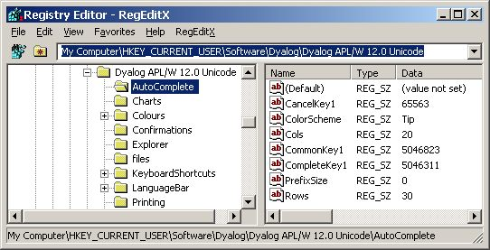

# Dealing with the Windows Registry =

## Overview

This class offers a limited range of methods useful to read, write and delete values from the Windows Registry without using .NET. It uses the [[https://en.wikipedia.org/wiki/Windows_Script_Host|Windows Scripting Host]]. Note that for safety reasons the Windows Script Host might not be available on your Windows box. If that is the case settle for `WinReg`.

For an all-singing-all-dancing class see [[WinReg]] which is much more powerful. However, `WinReg` is a complex and large class. If `WinRegSimple` offers what you need stick with it.

## Terminology

To understand the names of the methods you need to understand the terminology. If you find the terminology strange: so do I, but it was invented by Microsoft and therefore defines the standard. That is the reason why I decided to go for it: it makes it easier to understand the Microsoft documentation but also to understand others while talking about the Windows Registry.

In this picture:



you can see this string:

```
HKEY_CURRENT_USER\Software\Dyalog\Dyalog APL/W 12.0 Unicode\AutoComplete
```

at the top of the window.

HKEY_CURRENT_USER

: This is called a "Main key". There are a number of pre-defined main keys available you can choose from. There is also a shortcut available: instead of '''HKEY_CURRENT_USER''' you can use '''HKCU'''.

SOFTWARE\Dyalog\Dyalog APL/W 12.0 Unicode

: This is called a '''sub key'''.

:  On the right side you see a list. The entries in this list are called "values". Therefore '''!CancelKey1''' is a value.

:  Note that the '''''names''''' are called values; the actual data saved under a value is called "data".


## Shared Methods

```
Read
Write
Delete
```

## Restrictions

The `Write` method supports just two data types: REG_SZ and REG_DWORD.